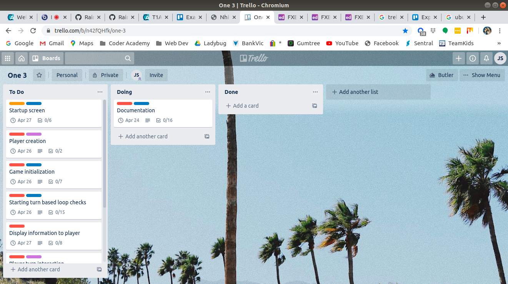
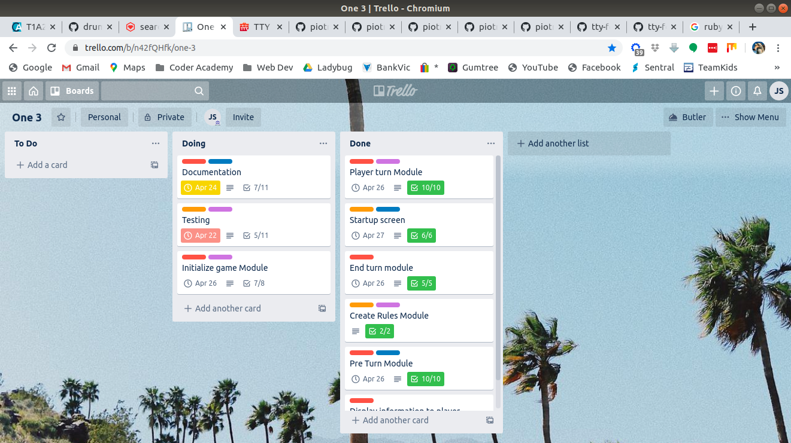

# One

###### A card game for my son and an assignment for Coder Academy

## Software Development Plan

### Statement of Purpose and Scope:

##### What the game does:

The game One is to be a Ruby language software version of Uno.

The basics of the game remain the same. The aim is to be the first player to lose all his or her cards. The deck is made up of cards consisting of the following:

- [ ] 4 different coloured cards (red, blue, yellow and green) with numbers ranging from 0-9. There are two of every number except 0 of which there is only one.
- [ ] In each colour  category, there are also special cards - skip, reverse and pickup 2.
- [ ] There are 3 wild cards which can be any colour determined by the player.
- [ ] There are 4 wild Pickup 4 cards

Each player starts with 7 cards and takes turns to discard a card onto a discard pile. The player can only play a card from their hand if it matches the top card of the discard pile by colour or number. If the player cannot play a card, they pick up from the deck. 

##### Why I chose an Uno game

As I am just starting on my coding journey, I thought this would be a good project to do as it is complicated enough to be challenging but simple enough that I think I can do it. This is a game that is played by my son and I almost every evening. I wanted to develop it to test my coding ability but also to impress my son. I'm hoping that once it's finished, he will be keen to play it with me. *Note - Now that it's finished, he bugs me to play it all the time :-)

##### Target Audience

My target audience is primarily my son Marshall. Anyone who enjoys Uno can download and play the game though. 

Given time to develop the program once it is submitted for the assignment, I'd like to include AI players and even test the validity of the AI's by getting them to play themselves. I'd also like to put a nice front end on it and have it as a good portfolio example. So potential target audience in future will also include people whom I'm trying to impress in the search for employment.

##### How to use it

People will be able to use it by downloading the repository from GitHub. There will be installation instructions to include the gems and necessary files below under the help file heading.

### Help File:

##### Installation Instructions:

1. Copy the One2 repository into a local directory from GitHub here: https://github.com/drumovski/One2. For instructions on downloading a repository, see here: https://help.github.com/en/github/creating-cloning-and-archiving-repositories/cloning-a-repository
2. this is what you should end up with if running from the terminal: "git clone https://github.com/drumovski/One2.git"
3. Ruby Language must be installed. For help installing Ruby, see here: https://www.ruby-lang.org/en/downloads/
4. In the terminal, navigate to the One2 directory "cd One2".
5. You may need to change the permissions of the one_install script. Do this by typing chmod u+x one_install && './one_install.sh' in the terminal. This only needs to be done once.
6. When running the game in future, just type ./ruby one2.rb from the **src directory**. For a list of arguments, see below.

##### System/Hardware requirements:

Very light computational hardware requirements. Ability to run terminal applications.

##### Dependencies:

Gems included in this program - 

1. Colorize
2. TTY-Font
3. TTY-Box

##### Arguments when starting game:

eg. ruby ./one2.rb -mp 8

possible arguments:

​      ''-h" help

​      '-s' skip splash screen

​      '-mp' change maximum players from 4 to a value specified eg -mp 8

​      Warning, changing the maximum value to an invalid number or to a number too high (10+) will cause the game to behave erratically

### List of Features:

##### Classes: 

###### Card class - variables: @color and @number. Number variable will include 0-9 for basic numbers but strings "reverse", "skip", "pickup 2" and "pickup 4" for action cards. The reason for this is to be able to compare the number variable easily when trying to match the discard pile to the players chosen card without additional code for a separate variable such as "type_of_card" Each card will be an instance.

###### Deck class - this will be a single instance "deck" containing an array "@cards" containing card objects 

###### Deck class methods - separate methods for creating the different parts of the deck - basic cards, actions cards, special cards. 

Fill deck - calls the separate methods for creating the deck. 

Replace_deck - if the deck runs out during play, this will turn the discard pile into a new deck. 

Take_card - pops a card from the end of the @cards array.

###### DiscardPile Class - this will be a single instance "discard_pile" similar to deck but starting empty.

###### Discard pile methods - 

Reset_discard_pile - starts the discard pile with a basic color card.

###### Player class - Each player will have an instance with variables: @name, @type (for future revision to include human or computer) @last_action (for ease of use when determining what happened on the previous turn in case of skip or reverse etc) and @hand - an array of the card instances that player is holding. Contains a @@player_count class variable to keep track of the number of players.

###### Player_class methods - 

Play_card - checks chosen card color and number against @hand colour and number and finds the correct card to play from the array. Once found, it removes it from the @hand and adds it to the discard_pile. 

##### Structure:

The main structure will be broken up into 5 main areas:

1. Splash screen
2. Initialization
3. Pre turn
4. Turn
5. End turn

The pre turn, turn and end turn will loop through until a winner is determined and then return to the splash screen where the user can start a new game.

##### Splash Screen:

Will contain a welcome screen with the option to view the rules, start a new game, or quit the game. The entered option will have error handling to ensure no invalid responses can be entered. This screen will also be displayed after the game finishes. I will contain this screen and it's functionality in a module

##### Initialization:

Player creation - user will enter number of players, validated against a maximum_number_of_players variable. Then prompted to enter each players name. This info will be stored in each player instance. Each player instance will then be stored in player_array. This will be used to keep track of turn order.

Deck creation - The deck will be created with card instances  each with color and number variables stored in an array - deck. See card class above.  It will then be randomised.

Discard pile creation - this is created as an empty array to hold all discarded card objects. The top card will be assigned to match_card for validation on the card the player is allowed to play. It must match a color or number. The top card will be taken from the deck to start the pile but another one chosen (if it is an action card - reverse, skip etc) until it is a basic color card.

Deal cards - Each player in player_array will be 'dealt' (card added to their hand and deleted from deck) 7 cards. This will be achieved by looping through the player_array.

##### Pre turn:

This will primarily used to check what happened the  previous round. 

Clear_screen method - this simply clears the screen from the previous player so the new player does not see the previous players hand. It will also print a message informing the player if they are about to miss their turn and why - via a message passed to it by the pickup 2, pickup 4, skip and reverse methods.

Miss_turn check - If a skip, reverse, pickup 2, or pickup 4 is played, the player misses their turn. This is checked by checking the last_action variable of the last person in the player_array. 

Pickup 2 - 2 cards are passed from the deck to the players hand via the player method - take_card. A message is also returned and passed to the player via clear_screen method that they miss their turn and pick up 2 cards.

Pickup 4 - 4 cards are passed from the deck to the players hand via the player method - take_card. A message is also returned and passed to the to the player via clear_screen method that they miss their turn and pick up 4 cards.

Reverse method - reverses the player_array via the built in method reverse. A message is also returned and passed to the player via clear_screen method that they miss their turn and a reverse was played.

Skip method - skips the current in the player array by player_array. This method doesn't do anything other than  return to the player via clear_screen method that they miss their turn and a skip was played. This is because any of these methods will skip the player having their turn by bypassing the turn method.

##### Turn:

Display_table - this method displays the players name, number of cards any opponents have left in their hand, cards left in the deck, and cards in the players hand.

Display_cards_can_play - matches the match card to all the cards in the players hand and stores them in play_array then displays them

Can_not_play - determines if the player can play any cards and skips the gets_chosen_card method if so. User then only needs to press enter to pick up a card

Pick_up_card - transfers a card from the deck via take_a_card method in deck class and adds it to players hand. Then deletes it from the deck.

Get_chosen_card - Asks for user to enter their chosen card to play. For expediency of play I abbreviated the valid inputs. See user interaction and experience below for details. The choice is then validated 3 times. Once for valid choice, twice to check if the card is in the players hand, and lastly to check if the card matches the match card and is valid to play. 

##### End turn:

Choose_wild_color - If a wild card is chosen, the player is prompted to enter the colour to continue play. The options will be R, Y, B, G. This will be validated to only have those options. The color of the match card will then be changed to the correct color.

Check_winner - This will check to see if the current player in the player_array has no cards left in their hand. If so, a winner screen with the players name will be displayed. I will include a gem to improve the look of the winner screen. Once a winner is found, this will end the pre_turn, turn and end_turn loop.

Next_player - this will move the current player in the player_array to the end so the next person in line has their go next.

Deck_swap - If the deck runs out of cards, this method will replace the deck with the discard_pile, reset the discard pile and randomise the deck.

##### Cmd arguments:

When starting the program, the user has 3 options entered in via cmd line arguments

-h - (help) displays the options available to play

-s (skip splash_screen) skips the splash screen for faster game loading

-mp (maximum_player, value) changes the value of the maximum player from 4 (default) to an entered value. Note, this can break the game if the number entered is too high (above 12 or so) as there will not be enough cards to deal to everyone and play the game.

### **User Interaction and Experience:**

Outline of user interaction and experience for the application *comprehensively* outlines with a *very high level of detail* how the user will find out how to interact with / use each feature; how the user will interact with / use each feature; and how errors will be handled by the application and displayed to the user.

User interaction will be text based through the terminal. 

##### Splash Screen:

There will be an opening graphic "ONE" which will be displayed using ascii art.

The user will be given 3 options to be chosen numerically 1-3. 1 - Start a new game. 2 - View the rules with an option to then return to splash screen by pressing enter, 3  - quit the game. 

The input will be validated to only accept integers between 1 and 3.

##### Player creation:

The user will be given the option to enter how many players will be playing, with a maximum cap determined by a variable defaulted to 4. The input will be validated to only accept integers between 1 and 4.

The user will then need to enter the names of each player. The input will be validated to not accept an empty string.

##### Player ready screen:

As multiple users should not be allowed to view each others hands when playing a 'hot seat' game, the screen will be cleared and the next players name will be printed to screen asking if they are ready for their turn. Pressing enter will start their turn, allowing other players to avert their eyes.

##### Turn Module:

User will be shown the number of cards in other players hands, number of cards in deck.

User will be shown their hand in 1 row with the colour of the card shown in that colour. Wild cards will be shown in purple.

User will be shown the cards they can play in another row.

User will be asked for input on the card they wish to play. For purpose of expediency I wish to abbreviate this into one single input with the following acceptable: 

(in all cases, lowercase input will be acceptable)

D = draw a card from the deck or,

R, Y, B, G (Red, Yellow, Blue, Green Colour), followed by 0-9 (example - R7 for Red 7, Y9 for Yellow 9, G0 for Green 0, B2 for Blue 2 etc) or,

R, Y, B, G (Red, Yellow, Blue, Green Colour), followed by P2 for Pickup 2 (example - RP2 for Red Pickup 2, BP2 for Blue Pickup 2) or,

R, Y, B, G (Red, Yellow, Blue, Green Colour), followed by S for Skip (example - RS for Red Skip, BS for Blue Skip) or,

R, Y, B, G (Red, Yellow, Blue, Green Colour), followed by R for Reverse (example - RR for Red Reverse, RR for Blue Reverse) or,

WC (Wild card) or,

WP4 (Wild Pickup 4).

This will be validated 3 times to check 

1. Valid input (one of the above)
2. Valid card in hand
3. Matches the discard pile

##### End Turn Module:

If the user plays a wild card, they need to input the colour that will continue the discard pile. They will just need to enter R, Y, G or B for the colour. This will be error checked for only those inputs in upper or lower case.

If a winner is determined, the name of the winner will be displayed in a fancy way.

##### Cmd Arguments Module:

When starting the program, the user has 3 options entered in via cmd line arguments

-h - (help) displays the options available to play

-s (skip splash_screen) skips the splash screen for faster game loading

-mp (maximum_player, value) changes the value of the maximum player from 4 (default) to an entered value. Note, this can break the game if the number entered is too high (above 12 or so) as there will not be enough cards to deal to everyone and play the game.

### Control Flow Diagram:

### Testing:

Most of the following tests were done manually within the game as it was being written and afterwards when playing. There are also some test/unit automatic tests included in the test folder. I know this was not the way it was intended to be done but I felt more confident doing it this way and I already had a code base to start with and was not familiar at all with test/unit. I now am able to see the value in TDD and will endeavour to do it the right way around the next time.

| Feature                | Test                                                         | data                                                         | expected outcome                                             | outcome                                                      |
| ---------------------- | ------------------------------------------------------------ | ------------------------------------------------------------ | ------------------------------------------------------------ | ------------------------------------------------------------ |
| fill_deck              | check correct number of cards                                | deck.cards. length                                           | 107                                                          | 107                                                          |
| replace_deck           | replaces deck with discard_pile after deck.cards.length < 4  | deck.cards. length > 100                                     | true                                                         | true                                                         |
| take_card              | check length after deck.take_card                            | deck.cards.length                                            | 106                                                          | 106                                                          |
| reset_discard_pile     | starts the discard pile with a basic color card.             | discard_pile. cards[0] .number == Integer                    | true                                                         | true                                                         |
| play_card              | checks chosen card color and number against @hand colour and number and finds the correct card to play from the array. | @hand.cards. color == color && @hand.cards. number == number | true                                                         | true                                                         |
| play_card              | removes correct card from the @hand and adds it to the discard_pile | discard_pile.cards object matches @hand object               | true                                                         | true                                                         |
| splash_screen          | gives options 1, 2, 3                                        | validates options correctly                                  | true                                                         | true                                                         |
| splash_screen          | displays rules                                               | rules                                                        | true                                                         | true                                                         |
| splash_screen          | quits game on 3                                              | quits                                                        | true                                                         | true                                                         |
| player_creation        | user will enter number of players, validated against a maximum_number_of_players variable. | number_of_ players = 7, 0, -4, f                             | error message                                                | error message                                                |
| player_creation        | Then prompted to enter each players name. This info will be stored in each player instance. | NIL                                                          | error message                                                | error message                                                |
| player_creation        | Each player instance will then be stored in player_array. This will be used to keep track of turn order. | player_array. length == number_ of_players                   | true                                                         | true                                                         |
| deck_creation          | The deck will be created with card instances  each with color and number variables stored in an array - deck. | deck.cards.length                                            | 107                                                          | 107                                                          |
| discard_pile creation  | discard_pile contains 1 card                                 | discard_pile .length                                         | 1                                                            | 1                                                            |
| deal_cards             | each player has 7 cards                                      | player_array [0].hand.cards. length                          | 7                                                            | 7                                                            |
| clear_screen           | Clears the screen from the previous player so the new player does not see the previous players hand. | displays correctly                                           | true                                                         | true                                                         |
| clear_screen           | Print a message informing the player if they are about to miss their turn and why - via a message passed to it by the pickup 2, pickup 4, skip and reverse methods. | displays correctly for each outcome (pickup 2, reverse, pickup 4, skip) | true                                                         | true                                                         |
| miss_turn_check        | skip, the player misses their turn                           | player_array rotates, player misses turn module              | true                                                         | true                                                         |
| miss_turn_check        | reverse, the player misses their turn                        | player_array rotates, player misses turn module              | true                                                         | true                                                         |
| miss_turn_check        | pickup 2, the player misses their turn                       | player_array rotates, player misses turn module              | true                                                         | true                                                         |
| miss_turn_check        | pickup 4 is played, the player misses their turn             | player_array rotates, player misses turn module              | true                                                         | true                                                         |
| pickup_ 2              | player picks up 2 cards                                      | player_array[0] .hand.cards .length ==                       | +2                                                           | +2                                                           |
| pickup_ 2              | display correct message in clear_screen                      | "Pickup 2 has been played. #{player_array[0]. name} has to pick up 2 cards" | true                                                         | true                                                         |
| pickup_ 4              | player picks up 4 cards                                      | player_array[0] .hand.cards .length ==                       | +4                                                           | +4                                                           |
| pickup_ 4              | display correct message in clear_screen                      | "Pickup 4 has been played. #{player_array[0]. name} has to pick up 4 cards" | true                                                         | true                                                         |
| reverse                | - reverses the player_array via the built in method reverse  | player_array                                                 | reversed!                                                    | reversed!                                                    |
| reverse                | display correct message in clear_screen                      | "#{player_array[0]. name} played a reverse"                  | true                                                         | true                                                         |
| skip                   | skips the current in the player array                        | player_array rotates, player misses turn module              | true                                                         | true                                                         |
| skip                   | display correct message in clear_screen                      | "#{player_array[0]. name} got skipped!"                      | true                                                         | true                                                         |
| display_table          | displays the players name                                    | player_array[0] .name = Jason                                | Jason                                                        | Jason                                                        |
| display_table          | number of cards any opponents have left in their hand        | cards = 7                                                    | 7                                                            | 7                                                            |
| display_table          | cards left in the deck                                       | deck.cards.length = 75                                       | 75                                                           | 75                                                           |
| display_table          | cards in the players hand with correct colours               | displays correctly                                           | true                                                         | true                                                         |
| display_cards_can_play | matches the match card to all the cards in the players hand  | validates and displays correctly                             | true                                                         | true                                                         |
| can_not_play           | determines if the player can play any cards                  | iterate player_array[0] .hand.cards == match_card            | false                                                        | false                                                        |
| can_not_play           | skips the gets_chosen_card method if true                    | skips method                                                 | true                                                         | true                                                         |
| pick_up_card           | transfers a card from the deck  and adds it to players hand. | player_array[0]. hand.cards. length                          | +1                                                           | +1                                                           |
| pick_up_card           | then deletes it from the deck.                               | deck.cards. length                                           | -1                                                           | -1                                                           |
| get_chosen_card        | validate for color                                           | f, 3, 4, b, y, #, -4                                         | 'Invalid color. Choose a color (Y, B, R, G) W (Wild) or enter D (Draw)' | 'Invalid color. Choose a color (Y, B, R, G) W (Wild) or enter D (Draw)' |
| get_chosen_card        | validate for number                                          | be, $, G12, Q, -2                                            | 'Invalid number. Choose 0-9, P2 (Pickup 2), P4 (Pickup 4), S (Skip), R (Reverse) or WC (Wild Card)' | 'Invalid number. Choose 0-9, P2 (Pickup 2), P4 (Pickup 4), S (Skip), R (Reverse) or WC (Wild Card)' |
| get_chosen_card        | check if the card is in the players hand,                    | b4, r7, rp2                                                  | 'You do not have that card in your hand.'                    | 'You do not have that card in your hand.'                    |
| get_chosen_card        | check if the card matches the match card and is valid to play. | g2, wp4, gs                                                  | 'You can not play that card, it does not match the discard.' | 'You can not play that card, it does not match the discard.' |
| choose_wild_color      | R, Y, B, G validated to only have those options.             | f, 3, #, "" NIL                                              | 'Invalid color. Choose a color (Y, B, R, G) W (Wild) or enter D (Draw)' | 'Invalid color. Choose a color (Y, B, R, G) W (Wild) or enter D (Draw)' |
| choose_wild_color      | color of the match card will then be changed to the chosen color. | color = "Red"                                                | match_ card == "Red Card"                                    | match_ card == "Red Card"                                    |
| check_winner           | winner screen with the players name will be displayed.       | player_array[0]. hand.cards = 0                              | "Jason is the winner"                                        | "Jason is the winner"                                        |
| check_winner           | end the pre_turn, turn and end_turn loop.                    | display splash_ screen                                       | true                                                         | true                                                         |
| next_player            | move the current player in the player_array to the end so the next person in line has their go next. | [player1, player2, player3]                                  | [player2, player3, player1]                                  | [player2, player3, player1]                                  |
| deck_swap              | replace the deck with the discard_pile                       | deck.cards = discard_pile.cards                              | true                                                         | true                                                         |
| deck_swap              | reset the discard pile                                       | discard_pile. cards.length                                   | 1                                                            | 1                                                            |
| deck_swap              | randomise the deck                                           | deck.cards. shuffle                                          | true                                                         | true                                                         |
| cmd_arguments          | help options display                                         |                                                              |                                                              |                                                              |
| cmd_arguments          | -s skips the splash screen                                   | -s                                                           | skips splash screen                                          | skips splash screen                                          |
| cmd_arguments          | -mp change the max players                                   | -mp 8                                                        | max_ players 8                                               | max_ players 8                                               |

### Implementation Plan:

##### Trello Board:

https://trello.com/b/n42fQHfk/one-3

##### Trello Screenshots:

##### Implementation Plan:

| Feature                       | Parts                                              | Due Date | Finished | Comments                                 |
| ----------------------------- | -------------------------------------------------- | -------- | -------- | ---------------------------------------- |
| Documentation                 | README.md                                          | Apr 24th | yes      |                                          |
| Documentation                 | Implementation plan                                | Apr 24th | yes      | due date not applicable                  |
| Documentation                 | Development Log                                    | Apr 24th | yes      | due date not applicable                  |
| Documentation                 | Project Management                                 | Apr 24th | yes      | due date not applicable                  |
| Testing                       | Write error handling validations into program      | Apr 22nd | yes      | finished after due date                  |
| Testing                       | Write automated testing script                     | Apr 22nd | yes      | Some finished after due date             |
| Testing                       | Write testing scenarios                            | Apr 22nd | yes      | most completed as code was being written |
| Startup screen                | View rules                                         | Apr 27th | yes      |                                          |
| Startup screen                | Add menu - quit, start game, view rules            | Apr 27th | yes      |                                          |
| Initialize game Module        | Enter number of players                            | Apr 26th | yes      |                                          |
| Initialize game Module        | Create array of players to become the turn order   | Apr 26th | yes      |                                          |
| Initialize game Module        | Enter names of each player                         | Apr 26th | yes      |                                          |
| Initialize game Module        | Deal cards                                         | Apr 26th | yes      |                                          |
| Initialize game Module        | create discard pile                                | Apr 26th | yes      |                                          |
| Initialize game Module        | initialize variables                               | Apr 26th | yes      |                                          |
| Pre Turn Module               | Pickup 2                                           | Apr 26th | yes      |                                          |
| Pre Turn Module               | Pickup 4                                           | Apr 26th | yes      |                                          |
| Pre Turn Module               | Skip                                               | Apr 26th | yes      |                                          |
| Pre Turn Module               | Reverse                                            | Apr 26th | yes      |                                          |
| Player turn Module            | Player input on what card to play                  | Apr 26th | yes      |                                          |
| Player turn Module            | Player input on what card to play                  | Apr 26th | yes      |                                          |
| Display information to player | Display hand                                       | Apr 25th | yes      |                                          |
| Display information to player | Display number of rounds                           | Apr 25th | yes      |                                          |
| Display information to player | Display number of cards in other players hands     | Apr 25th | yes      |                                          |
| End turn module               | Check for winner                                   | Apr 25th | yes      |                                          |
| End turn module               | add functionality for reaching the end of the deck | Apr 25th | yes      |                                          |
| Create Rules Module           | Write rules                                        | Apr 27th | yes      |                                          |
| Cmd_Arguments                 | write some command arguments                       | Apr 27th | yes      |                                          |

